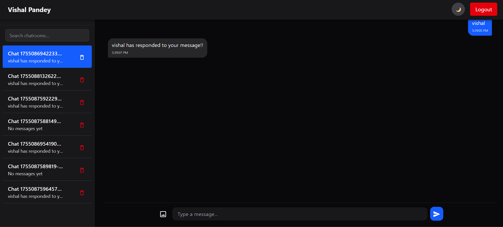

# Gemini Frontend Clone

[](https://gemini-frontend-clone-sigma.vercel.app/login)

A modern Gemini AI chatbot interface like clone built with React, Vite, and Tailwind CSS. Features responsive design, real-time chat, and seamless state management with Redux Toolkit.



---

## 🚀 Project Overview

This project replicates the core functionality of Google's Gemini AI interface with:

- Real-time AI-powered conversations
- Responsive design for all devices
- Dark/light theme support
- Form validation and error handling with React Hook Form & Zod
- Persistent chat history using localStorage

**Live Demo:** [https://gemini-frontend-clone-sigma.vercel.app/login](https://gemini-frontend-clone-sigma.vercel.app/login)  

---

## 🛠️ Setup and Run Instructions

1. **Clone the repository:**
   ```bash
   git clone https://github.com/akyllus/gemini-frontend-clone.git
   cd gemini-frontend-clone
   ```

2. **Install dependencies:**
   ```bash
   npm install
   ```

3. **Run development server:**
   ```bash
   npm run dev
   ```
   App will be available at [http://localhost:5173](http://localhost:5173)

5. **Production build:**
   ```bash
   npm run build
   npm run preview
   ```

---

## 📁 Project Structure

```
/gemini-frontend-clone
├── /src
│   ├── /components             #components
│   ├── /constant               #global contstant and Toast Messages
│   ├── /hooks                  #custom hooks
│   ├── /pages                  #signup, signin and Dashboard Page
│   ├── /services               #API calls
│   └── main.jsx                # App entry point
├── vite.config.js              # Vite configurationsetup


🛠️ Technologies Used

- **Core:** React 19, Vite
- **State Management:** Redux Toolkit
- **Styling:** Tailwind CSS 
- **UI Components:** Material UI Icons
- **Form Handling:** React Hook Form + Zod
- **Notifications:** React Hot Toast
- **Routing:** React Router DOM


## 📜 License

Create by: Vishal Pandey 
          igvishalpandey@gmail.com
